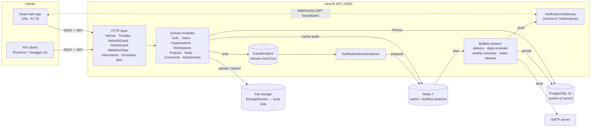
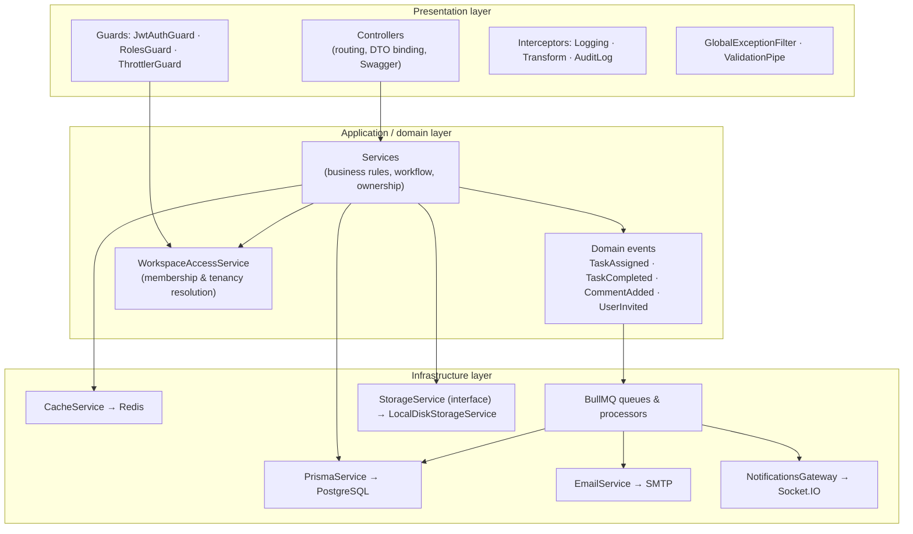
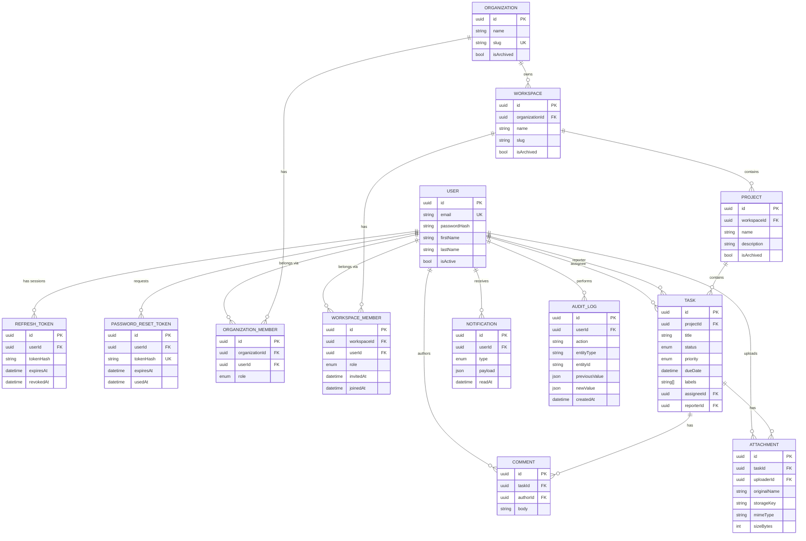
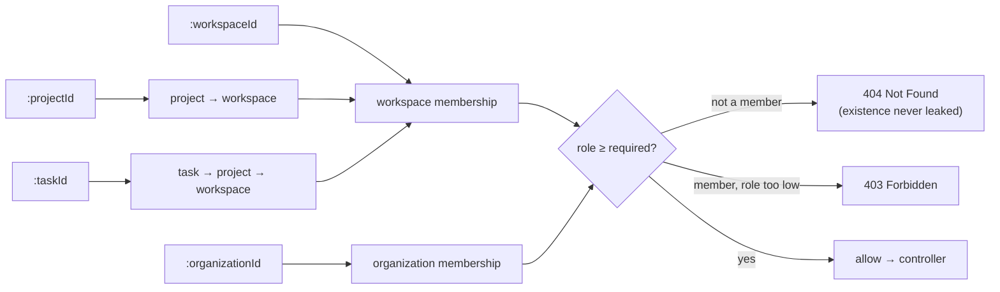
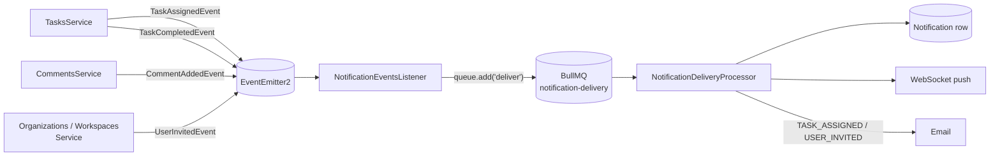
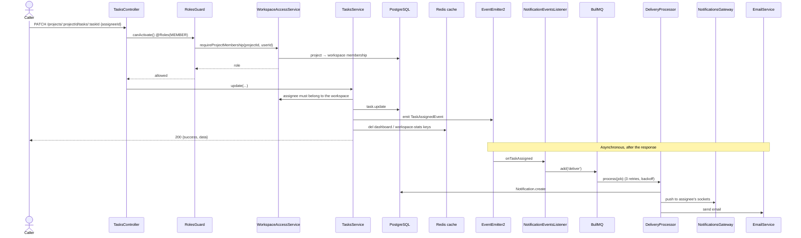
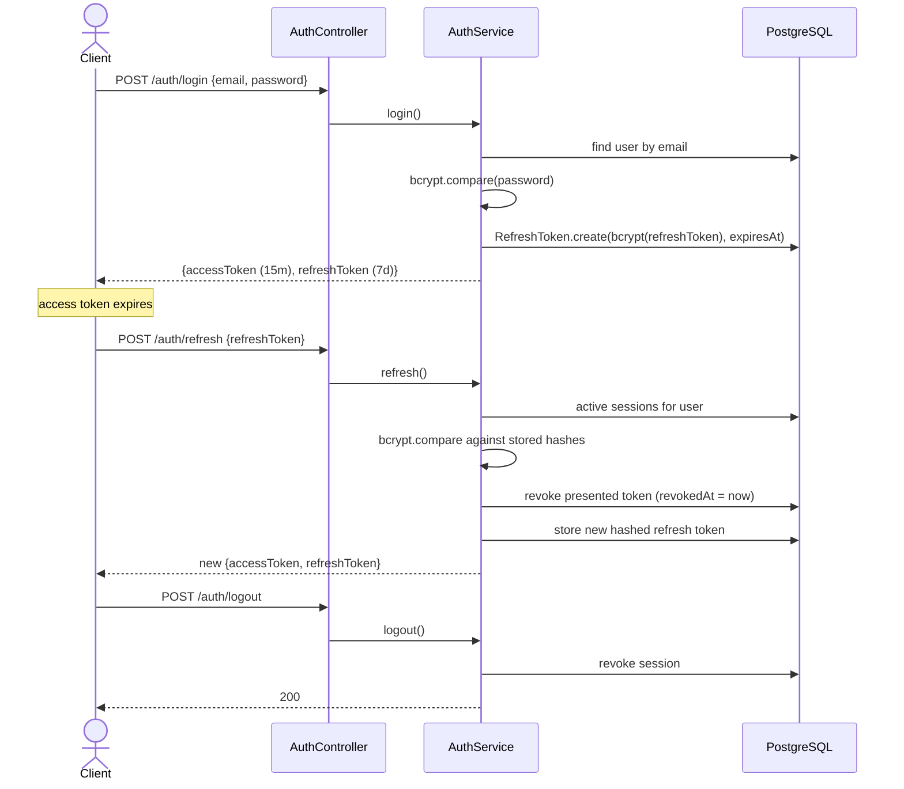

# Enterprise Collaboration Platform (ECP)

A multi-tenant, backend-first SaaS collaboration platform in the spirit of
Notion, ClickUp and Jira. Organizations create workspaces, run projects, assign
and track tasks through a defined workflow, discuss work in comments, attach
files, receive real-time and email notifications, and keep a full audit trail
of every critical change. Each organization's data is strictly isolated from
every other's.

The system is built with **NestJS + TypeScript** on **PostgreSQL (Prisma)**,
with **Redis** for caching, **BullMQ** for background processing, **Socket.IO**
for real-time push, and **Docker Compose** for local infrastructure. It is
organized as a **Turborepo monorepo** containing the API, a React web client,
and a shared-types package.

---

## Table of contents

1. [Highlights](#1-highlights)
2. [Functional requirements](#2-functional-requirements)
3. [Non-functional requirements](#3-non-functional-requirements)
4. [Technology stack](#4-technology-stack)
5. [System architecture](#5-system-architecture)
6. [Application architecture (module map)](#6-application-architecture-module-map)
7. [Database design (ER diagram)](#7-database-design-er-diagram)
8. [Authentication & authorization](#8-authentication--authorization)
9. [Event-driven architecture](#9-event-driven-architecture)
10. [Background jobs](#10-background-jobs)
11. [Caching strategy](#11-caching-strategy)
12. [File management](#12-file-management)
13. [Audit logging](#13-audit-logging)
14. [Sequence diagrams](#14-sequence-diagrams)
15. [API standards & reference](#15-api-standards--reference)
16. [Error handling & logging](#16-error-handling--logging)
17. [Security](#17-security)
18. [Testing](#18-testing)
19. [Getting started](#19-getting-started)
20. [Configuration reference](#20-configuration-reference)
21. [Repository layout](#21-repository-layout)
22. [Git workflow & CI](#22-git-workflow--ci)
23. [Architecture decision records](#23-architecture-decision-records)
24. [Documentation index](#24-documentation-index)
25. [Roadmap & known limitations](#25-roadmap--known-limitations)

---

## 1. Highlights

- **Multi-tenant by design.** Organization → Workspace → Project → Task
  hierarchy, with every request resolved back to a workspace membership before
  any data is read or written.
- **Four-level RBAC** (`OWNER > ADMIN > MEMBER > VIEWER`) enforced by a single
  generic guard that works at any nesting depth.
- **Event-driven notifications.** Feature services emit domain events. A
  listener enqueues BullMQ jobs, and a single worker persists, pushes
  (WebSocket) and emails notifications.
- **Scheduled background jobs** for daily due-date reminders, weekly summaries
  and expired-token cleanup, all retried with exponential backoff.
- **Redis cache-aside** for the personal dashboard, user profiles and
  workspace statistics, with explicit invalidation on writes. The cache fails
  open, so a Redis outage never fails a request.
- **Declarative audit logging.** A `@AuditLog()` decorator and a global
  interceptor record who changed what, with before and after snapshots.
- **Pluggable file storage** behind a `StorageService` interface, with size
  and MIME validation and server-generated storage keys.
- **Consistent API contract.** Uniform success and error envelopes, a global
  validation pipe, pagination, filtering, sorting and search.
- **Production concerns built in.** Helmet, rate limiting, health checks
  (`@nestjs/terminus`), a GitHub Actions CI pipeline, SonarCloud analysis,
  hardened non-root Docker images and SHA-pinned CI actions.

---

## 2. Functional requirements

Status legend: ✅ implemented · 🟡 partially implemented · 🔜 planned

### 2.1 Authentication

| ID | Requirement | Status | Notes |
|----|-------------|:------:|-------|
| FR-AUTH-1 | Register a new user account | ✅ | bcrypt-hashed password (cost 12) |
| FR-AUTH-2 | Log in with email and password | ✅ | Returns an access and refresh token pair; generic error message on failure |
| FR-AUTH-3 | Refresh an access token | ✅ | Refresh tokens **rotate** on every use; the presented token is revoked |
| FR-AUTH-4 | Log out | ✅ | Revokes the server-side refresh token session |
| FR-AUTH-5 | Password reset (request and confirm) | ✅ | Single-use, SHA-256-hashed, 30-minute token delivered by email |

### 2.2 Organizations

| ID | Requirement | Status | Notes |
|----|-------------|:------:|-------|
| FR-ORG-1 | Create an organization (creator becomes OWNER) | ✅ | Unique slug |
| FR-ORG-2 | List and view organizations the caller belongs to | ✅ | Non-members get `404` |
| FR-ORG-3 | Edit an organization | ✅ | ADMIN+ |
| FR-ORG-4 | Archive an organization | ✅ | OWNER |
| FR-ORG-5 | Delete an organization | ✅ | OWNER, cascades |
| FR-ORG-6 | Invite members to an organization | ✅ | ADMIN+, emits `UserInvitedEvent` |

### 2.3 Workspaces

| ID | Requirement | Status | Notes |
|----|-------------|:------:|-------|
| FR-WS-1 | Create a workspace inside an organization | ✅ | Slug unique per organization |
| FR-WS-2 | Edit a workspace | ✅ | ADMIN+ |
| FR-WS-3 | Archive a workspace | ✅ | OWNER |
| FR-WS-4 | Delete a workspace | ✅ | OWNER |
| FR-WS-5 | Invite members with a role | ✅ | ADMIN+, emits `UserInvitedEvent` |
| FR-WS-6 | Workspace statistics (members, projects, tasks by status) | ✅ | Redis-cached |

### 2.4 Projects

| ID | Requirement | Status | Notes |
|----|-------------|:------:|-------|
| FR-PRJ-1 | Create a project in a workspace | ✅ | MEMBER+ |
| FR-PRJ-2 | Update a project | ✅ | ADMIN+ |
| FR-PRJ-3 | Archive and restore a project | ✅ | ADMIN+ |
| FR-PRJ-4 | Delete a project | ✅ | OWNER |
| FR-PRJ-5 | Search projects | ✅ | `?search=` (case-insensitive name match), paginated, optional `includeArchived` |

### 2.5 Tasks

| ID | Requirement | Status | Notes |
|----|-------------|:------:|-------|
| FR-TSK-1 | Create a task with title, description, assignee, reporter, priority, due date, labels and status | ✅ | Reporter is set to the caller; the assignee must belong to the same workspace |
| FR-TSK-2 | Update a task | ✅ | MEMBER+ |
| FR-TSK-3 | Enforce the status workflow `TODO → IN_PROGRESS → REVIEW → DONE` | ✅ | Enforced in the service layer; skipping or reversing steps is rejected with `400` |
| FR-TSK-4 | Delete a task | ✅ | ADMIN+ |
| FR-TSK-5 | List tasks with pagination, filtering and sorting | ✅ | `?status=&priority=&assigneeId=&sort=&page=&limit=` |
| FR-TSK-6 | Priorities `LOW / MEDIUM / HIGH / URGENT` | ✅ | |

### 2.6 Comments

| ID | Requirement | Status | Notes |
|----|-------------|:------:|-------|
| FR-CMT-1 | Create a comment on a task | ✅ | MEMBER+, emits `CommentAddedEvent` |
| FR-CMT-2 | List comments on a task | ✅ | Any workspace member |
| FR-CMT-3 | Edit own comment | ✅ | Author only |
| FR-CMT-4 | Delete own comment | ✅ | Author only |

### 2.7 Attachments

| ID | Requirement | Status | Notes |
|----|-------------|:------:|-------|
| FR-ATT-1 | Upload a file to a task | ✅ | Multipart, MEMBER+ |
| FR-ATT-2 | Size validation | ✅ | Configurable, 10 MB by default |
| FR-ATT-3 | MIME validation | ✅ | Allow-list of images, PDF, Office documents, text, CSV and zip |
| FR-ATT-4 | Unique filenames | ✅ | Server-generated UUID storage keys; the client filename is kept only as metadata |
| FR-ATT-5 | Storage abstraction | ✅ | `StorageService` interface with a local-disk adapter |
| FR-ATT-6 | List, download and delete attachments | ✅ | Delete by the uploader or ADMIN+ |

### 2.8 Notifications

| ID | Requirement | Status | Notes |
|----|-------------|:------:|-------|
| FR-NTF-1 | Notify on task assigned | ✅ | In-app, WebSocket and email |
| FR-NTF-2 | Notify on task completed | ✅ | In-app and WebSocket |
| FR-NTF-3 | Notify on comment added | ✅ | In-app and WebSocket |
| FR-NTF-4 | Notify on user invited | ✅ | In-app, WebSocket and email |
| FR-NTF-5 | Asynchronous processing | ✅ | Domain event → BullMQ → worker |
| FR-NTF-6 | List own notifications and mark them read | ✅ | Paginated |
| FR-NTF-7 | Daily due-date reminders and weekly summaries | ✅ | Scheduled BullMQ jobs |

### 2.9 Audit logs

| ID | Requirement | Status | Notes |
|----|-------------|:------:|-------|
| FR-AUD-1 | Record every critical action | ✅ | 21 mutating endpoints are decorated with `@AuditLog` |
| FR-AUD-2 | Store the user, action, timestamp, entity, previous values and new values | ✅ | Generic `audit_logs` table with JSON before and after snapshots |

### 2.10 Users and dashboard

| ID | Requirement | Status | Notes |
|----|-------------|:------:|-------|
| FR-USR-1 | View own profile | ✅ | Cached |
| FR-USR-2 | Personal dashboard (workspaces, projects, tasks by status, overdue, recent tasks) | ✅ | Cached and invalidated on task changes |
| FR-USR-3 | Look up a user by email (to invite them) | ✅ | |

### 2.11 Operational

| ID | Requirement | Status | Notes |
|----|-------------|:------:|-------|
| FR-OPS-1 | Liveness and readiness health endpoint | ✅ | Postgres, Redis and heap checks; `200` or `503` |
| FR-OPS-2 | Interactive API documentation | ✅ | Swagger UI at `/docs` |
| FR-OPS-3 | Seed data for demos | ✅ | `npm run prisma:seed` |

---

## 3. Non-functional requirements

| ID | Quality | How it is achieved |
|----|---------|--------------------|
| NFR-1 | **Modularity** | One NestJS module per domain (auth, organizations, workspaces, projects, tasks, comments, attachments, notifications, queue, redis, storage, email, health). Cross-cutting concerns live in `common/`. |
| NFR-2 | **Scalability** | The API process is stateless (JWT auth, with state in Postgres and Redis). Slow work (notifications, email, reminders) runs on BullMQ queues and doesn't block requests. Hot read paths are cached in Redis. Queue workers can be scaled on their own. |
| NFR-3 | **Security** | JWT with rotating hashed refresh tokens, bcrypt, RBAC on every route, `404` rather than `403` for non-members, Helmet, rate limiting, strict input whitelisting, a parameterized ORM, upload validation and a path-traversal-safe storage adapter. See [§17](#17-security). |
| NFR-4 | **Maintainability** | Clean Architecture layering. Controllers contain no business logic. SOLID, dependency injection throughout, typed configuration, ESLint and Prettier, SonarCloud static analysis. |
| NFR-5 | **Testability** | Every service depends on injected abstractions (Prisma, cache, storage, queues, email), so each is unit-tested in isolation. E2E tests use Supertest against a real Postgres and Redis. |
| NFR-6 | **Reusability** | Shared building blocks: `WorkspaceAccessService`, `RolesGuard`, `@AuditLog`, `CacheService`, `StorageService` and the `@ecp/shared-types` package used by both API and web. |
| NFR-7 | **Reliability** | Jobs retry 3 times with exponential backoff (starting at 5 s). The cache fails open. Health checks gate container readiness. Graceful Prisma shutdown hooks are in place. |
| NFR-8 | **Performance** | Cache-aside with 60–120 s TTLs plus explicit invalidation. Paginated list endpoints. Parallel aggregate queries (`Promise.all`) on the dashboard. `SCAN`-based prefix invalidation that never blocks Redis. |
| NFR-9 | **Observability** | A global logging interceptor records method, path, status and latency. Structured error logging lives in the exception filter. `/health` is available for orchestration. |
| NFR-10 | **Documentation** | This README, Swagger, ER, architecture and sequence diagrams, ADRs, a Postman collection and a Git workflow guide. |
| NFR-11 | **Portability** | Docker Compose runs the entire stack. Multi-stage, non-root Dockerfiles. Prisma binary targets cover both native and Alpine (OpenSSL 3). |
| NFR-12 | **Data isolation** | Every tenant-scoped query is resolved through a workspace membership. Nested resources (task, comment, attachment) resolve their workspace by joining up the chain, so no ID from another tenant can be reached. |

---

## 4. Technology stack

| Concern | Choice |
|---------|--------|
| Runtime / language | Node.js 20, TypeScript 5 |
| Framework | NestJS 10 |
| Database | PostgreSQL 16 |
| ORM / migrations | Prisma 5 |
| Authentication | JWT (`@nestjs/jwt`, Passport), access and rotating refresh tokens |
| Password hashing | bcrypt |
| Validation | class-validator / class-transformer |
| Queue / scheduler | BullMQ (`@nestjs/bullmq`) |
| Cache | Redis 7 (ioredis) |
| Domain events | `@nestjs/event-emitter` (EventEmitter2) |
| Real-time | Socket.IO WebSocket gateway |
| Email | Nodemailer (SMTP) |
| Health checks | `@nestjs/terminus` |
| Rate limiting | `@nestjs/throttler` |
| Security headers | Helmet |
| API docs | Swagger / OpenAPI |
| Testing | Jest, Supertest |
| Monorepo tooling | Turborepo and npm workspaces |
| Frontend | React and Vite |
| Containers | Docker, Docker Compose |
| CI / quality | GitHub Actions, SonarCloud |

---

## 5. System architecture



**Runtime components**

| Component | Responsibility |
|-----------|----------------|
| **API** | Stateless NestJS process that serves REST, WebSocket and the BullMQ workers. |
| **PostgreSQL** | The source of truth for all domain data, tokens, notifications and audit logs. |
| **Redis** | Two roles: the cache-aside store and the BullMQ job broker. |
| **File storage** | Behind `StorageService`. Local disk today, with an interface ready for S3-compatible backends. |
| **SMTP** | Optional. When `SMTP_HOST` is empty, `EmailService` logs and no-ops. |
| **Web** | React client for login, registration and the dashboard. |

---

## 6. Application architecture (module map)

The API follows **Clean Architecture**, **SOLID** and **dependency injection**:



**Design rules**

- **Controllers never contain business logic.** They bind and validate DTOs,
  apply guards and decorators, and delegate to exactly one service call.
- **Services own every business rule**, including status transitions,
  ownership checks, assignee-in-workspace validation, cache invalidation and
  event emission.
- **Infrastructure is injected**, never instantiated. Storage is bound to an
  interface token, so another backend can be swapped in without touching
  `AttachmentsService` (Dependency Inversion).
- **Producers don't know about consumers.** Feature services emit events and
  never call the notification stack directly (Open/Closed: a new channel only
  touches the delivery worker).
- **Tenancy resolution lives in one place** (`WorkspaceAccessService`) and is
  shared by the guard and the services.

**Global request pipeline**

```
Request → Helmet → ThrottlerGuard → JwtAuthGuard → RolesGuard (per route)
        → ValidationPipe → LoggingInterceptor → TransformInterceptor
        → AuditLogInterceptor → Controller → Service
        ← { success: true, statusCode, data }   |   GlobalExceptionFilter → { success: false, ... }
```

---

## 7. Database design (ER diagram)

The full ER model, with field-level detail, is in
[apps/api/docs/ER_DIAGRAM.md](apps/api/docs/ER_DIAGRAM.md). The schema is in
[apps/api/prisma/schema.prisma](apps/api/prisma/schema.prisma).



**Enums**

| Enum | Values |
|------|--------|
| `WorkspaceRole` | `OWNER`, `ADMIN`, `MEMBER`, `VIEWER` |
| `TaskStatus` | `TODO`, `IN_PROGRESS`, `REVIEW`, `DONE` |
| `TaskPriority` | `LOW`, `MEDIUM`, `HIGH`, `URGENT` |
| `NotificationType` | `TASK_ASSIGNED`, `TASK_COMPLETED`, `COMMENT_ADDED`, `USER_INVITED`, `TASK_DUE_REMINDER`, `WEEKLY_SUMMARY` |

**Key modelling decisions**

- **Organization roles and workspace roles are independent.** A user can be
  an ADMIN of an organization but a VIEWER in a particular workspace.
- **Tenancy is derived rather than duplicated.** Tasks, comments and
  attachments don't carry a `workspaceId`. Access is resolved by joining
  `task → project → workspace`, so there is no denormalized tenant column that
  could drift out of sync.
- **Uniqueness constraints** on `(organizationId, userId)`,
  `(workspaceId, userId)` and `(organizationId, slug)` prevent duplicate
  memberships and slugs at the database level.
- **A generic audit table** (`entityType` + `entityId` + JSON snapshots)
  avoids needing one audit table per entity.
- **Tokens are stored hashed**: refresh tokens with bcrypt and reset tokens
  with SHA-256.
- **Cascades** (`onDelete: Cascade`) along the ownership chain keep deletes
  consistent. Snake-case table and column names come from `@@map`/`@map`.
- **Migrations** are versioned under `apps/api/prisma/migrations/`.

---

## 8. Authentication & authorization

### 8.1 Authentication

- `JwtAuthGuard` is registered **globally** (`APP_GUARD`), so every route is
  protected unless it is explicitly marked `@Public()` (register, login,
  refresh, password reset and health).
- **Access tokens** are short-lived (15 minutes by default).
- **Refresh tokens** last 7 days by default. Each one is stored as a bcrypt
  hash, one row per session, and **rotated** on every refresh: the presented
  token is revoked when a new pair is issued. Logout revokes the session.
- **WebSocket connections** authenticate at the handshake with the same access
  token (`auth: { token }`). Unauthenticated sockets are disconnected.

### 8.2 Role-based access control

Role hierarchy: **OWNER > ADMIN > MEMBER > VIEWER**. A route declares its
minimum role with `@Roles(...)`. `RolesGuard` resolves the caller's role from
whichever route parameter identifies the resource, walking the ownership
chain through `WorkspaceAccessService`:



Rules that can't be expressed as a minimum role are enforced in the service
layer: *edit or delete own comment*, and *delete an attachment if you are the
uploader or ADMIN+*.

### 8.3 Permission matrix

| Action | Owner | Admin | Member | Viewer |
|--------|:-----:|:-----:|:------:|:------:|
| View workspace, projects, tasks, comments, attachments | ✅ | ✅ | ✅ | ✅ |
| Create project / task / comment / attachment | ✅ | ✅ | ✅ | ❌ |
| Update task (incl. status and assignee) | ✅ | ✅ | ✅ | ❌ |
| Edit or delete **own** comment | ✅ | ✅ | ✅ | ❌ |
| Delete **own** attachment | ✅ | ✅ | ✅ | ❌ |
| Delete **any** attachment | ✅ | ✅ | ❌ | ❌ |
| Update workspace / organization / project | ✅ | ✅ | ❌ | ❌ |
| Archive and restore project | ✅ | ✅ | ❌ | ❌ |
| Delete task | ✅ | ✅ | ❌ | ❌ |
| Invite members | ✅ | ✅ | ❌ | ❌ |
| Archive or delete workspace / organization | ✅ | ❌ | ❌ | ❌ |
| Delete project | ✅ | ❌ | ❌ | ❌ |

Each endpoint therefore checks **authentication** (JWT), **authorization**
(role) and **workspace ownership** (tenant membership resolved from the
resource).

---

## 9. Event-driven architecture

Feature services never call the notification pipeline directly. They emit a
typed domain event and return. This decouples *"something happened"* from
*"how users find out"*.



| Event | Emitted when | Recipient | Channels |
|-------|--------------|-----------|----------|
| `TaskAssignedEvent` | A task is created with an assignee, or reassigned | Assignee | In-app, WebSocket, email |
| `TaskCompletedEvent` | A task moves to `DONE` | Reporter | In-app, WebSocket |
| `CommentAddedEvent` | A comment is posted | Task assignee and reporter (excluding the commenter) | In-app, WebSocket |
| `UserInvitedEvent` | A user is added to an organization or workspace | Invitee | In-app, WebSocket, email |

A single processor is the only code that writes a `Notification` row, pushes
to sockets and sends mail. Adding a channel (Slack, for example) changes one
class. See [ADR 0002](apps/api/docs/adr/0002-event-driven-notifications.md).

---

## 10. Background jobs

All queues share the Redis connection and one retry policy: **3 attempts,
exponential backoff starting at 5 s**. Completed jobs are kept for 24 h and
failed jobs for 7 days, for inspection.

| Queue | Trigger | Schedule (default) | What it does |
|-------|---------|--------------------|--------------|
| `notification-delivery` | Domain events and the jobs below | On demand | Persists the notification, pushes it over WebSocket, emails where relevant |
| `daily-reminder` | BullMQ repeatable job | `0 8 * * *` (daily 08:00) | Finds incomplete, assigned tasks that are due within 24 h or overdue, and sends `TASK_DUE_REMINDER` to each assignee |
| `weekly-summary` | BullMQ repeatable job | `0 8 * * 1` (Monday 08:00) | Sends each active user a count of tasks assigned to them and completed in the last 7 days (`WEEKLY_SUMMARY`) |
| `cleanup-expired-tokens` | BullMQ repeatable job | `0 3 * * *` (daily 03:00) | Deletes expired or revoked refresh tokens and used or expired reset tokens |

Repeatable jobs are registered idempotently at startup by
`QueueSchedulerService`, using stable job IDs so restarts don't create
duplicate schedules. The reminder and summary crons are configurable through
environment variables.

---

## 11. Caching strategy

Pattern: **cache-aside** on Redis through `CacheService`, which fails open
(any Redis error is logged and treated as a miss).

| Cached data | Key | TTL | Invalidated by |
|-------------|-----|-----|----------------|
| Personal dashboard | `dashboard:{userId}` | 60 s | Task create, update or delete affecting that user |
| Workspace statistics | `workspace-stats:{workspaceId}` | 60 s | Task mutations, project archive/restore/delete, membership changes |
| User profile | `user-profile:{userId}` | 120 s | TTL expiry (there is no profile-update endpoint yet) |

Cache keys are built by shared helpers in `common/cache-keys.ts`, so the read
and invalidation sides can never disagree on key format. Prefix invalidation
uses `SCAN`, never `KEYS`.

---

## 12. File management

- **Upload** is `multipart/form-data` to `POST /tasks/:taskId/attachments`.
- **Size validation** enforces `UPLOAD_MAX_SIZE_MB`, 10 MB by default.
- **MIME validation** uses an explicit allow-list: JPEG, PNG, GIF and WebP
  images, PDF, Word, Excel, PowerPoint, plain text, CSV and ZIP. Anything else
  returns `400`.
- **Unique filenames**: the storage key is a server-generated UUID plus a
  sanitized extension. The client filename is stored only as `originalName`
  metadata.
- **Storage abstraction**: `AttachmentsService` depends on the
  `StorageService` interface (`upload`, `getStream`, `delete`).
  `LocalDiskStorageService` is the current adapter and rejects any key that
  would resolve outside its root directory (path-traversal protection). An
  S3-compatible adapter can be bound without changing business code.
- **Download** streams the file with its original name and MIME type.
  Workspace membership is checked first.

---

## 13. Audit logging

Critical mutations are declared with a decorator:

```ts
@AuditLog('task.update', 'Task', 'taskId')
@Patch(':taskId')
update(...) { ... }
```

The global `AuditLogInterceptor` captures the **previous value** before the
handler runs and the **new value** after it resolves, then writes:

| Field | Meaning |
|-------|---------|
| `userId` | Who performed the action |
| `action` | e.g. `task.update`, `workspace.inviteMember` |
| `entityType` / `entityId` | What was changed |
| `previousValue` / `newValue` | JSON snapshots before and after |
| `createdAt` | When it happened |

**Audited actions (21):** `organization.update/archive/delete/inviteMember`,
`workspace.update/archive/delete/inviteMember`,
`project.create/update/archive/restore/delete`, `task.create/update/delete`,
`comment.create/update/delete` and `attachment.create/delete`.

---

## 14. Sequence diagrams

### 14.1 Assigning a task (RBAC → event → queue → delivery)



### 14.2 Login and refresh-token rotation



More detail is in
[apps/api/docs/SEQUENCE_DIAGRAM.md](apps/api/docs/SEQUENCE_DIAGRAM.md).

---

## 15. API standards & reference

- **Base URL:** `http://localhost:3000/api/v1`
- **Swagger UI:** `http://localhost:3000/docs`
- **Postman collection:**
  [apps/api/docs/postman/ECP-Platform.postman_collection.json](apps/api/docs/postman/ECP-Platform.postman_collection.json)

### 15.1 Conventions

| Standard | Implementation |
|----------|----------------|
| Request validation | DTOs with class-validator. A global `ValidationPipe` with `whitelist`, `forbidNonWhitelisted` and `transform` |
| Consistent responses | `TransformInterceptor` → `{ success: true, statusCode, data }` |
| Consistent errors | `GlobalExceptionFilter` → `{ success: false, statusCode, path, timestamp, message, error? }` |
| Pagination | `?page=&limit=` on list endpoints (projects, tasks, notifications) |
| Filtering | Tasks: `?status=&priority=&assigneeId=`. Projects: `?includeArchived=` |
| Sorting | Tasks: `?sort=` one of `createdAt`, `dueDate`, `priority`, `status`, `title` (prefix `-` for descending) |
| Searching | Projects: `?search=` |
| Status codes | `200` OK · `201` Created · `204` No Content · `400` validation or illegal transition · `401` bad or expired JWT · `403` insufficient role · `404` not found or not a member · `409` conflict (duplicate email or slug) · `429` throttled · `503` unhealthy |
| Versioning | URI prefix `/api/v1` |

### 15.2 Endpoints

**Auth** — `/auth`
| Method | Path | Access |
|--------|------|--------|
| POST | `/register` | Public |
| POST | `/login` | Public |
| POST | `/refresh` | Public (refresh token) |
| POST | `/logout` | Authenticated |
| POST | `/password-reset/request` | Public |
| POST | `/password-reset/confirm` | Public |

**Users** — `/users`
| Method | Path | Access |
|--------|------|--------|
| GET | `/me` | Authenticated |
| GET | `/me/dashboard` | Authenticated (cached) |
| GET | `/lookup?email=` | Authenticated |
| GET | `/:id` | Authenticated |

**Organizations** — `/organizations`
| Method | Path | Access |
|--------|------|--------|
| POST | `/` | Authenticated |
| GET | `/` · `/:organizationId` | Member |
| PATCH | `/:organizationId` | ADMIN+ |
| POST | `/:organizationId/archive` | OWNER |
| DELETE | `/:organizationId` | OWNER |
| POST | `/:organizationId/members` | ADMIN+ |

**Workspaces** — `/workspaces`
| Method | Path | Access |
|--------|------|--------|
| POST | `/` | Organization member |
| GET | `/` · `/:workspaceId` | Member |
| GET | `/:workspaceId/stats` | Member (cached) |
| PATCH | `/:workspaceId` | ADMIN+ |
| POST | `/:workspaceId/archive` | OWNER |
| DELETE | `/:workspaceId` | OWNER |
| POST | `/:workspaceId/members` | ADMIN+ |

**Projects** — `/workspaces/:workspaceId/projects`
| Method | Path | Access |
|--------|------|--------|
| POST | `/` | MEMBER+ |
| GET | `/?search=&includeArchived=&page=&limit=` | Member |
| GET | `/:projectId` | Member |
| PATCH | `/:projectId` | ADMIN+ |
| POST | `/:projectId/archive` · `/:projectId/restore` | ADMIN+ |
| DELETE | `/:projectId` | OWNER |

**Tasks** — `/projects/:projectId/tasks`
| Method | Path | Access |
|--------|------|--------|
| POST | `/` | MEMBER+ |
| GET | `/?status=&priority=&assigneeId=&sort=&page=&limit=` | Member |
| GET | `/:taskId` | Member |
| PATCH | `/:taskId` | MEMBER+ (status workflow enforced) |
| DELETE | `/:taskId` | ADMIN+ |

**Comments** — `/tasks/:taskId/comments`
| Method | Path | Access |
|--------|------|--------|
| POST | `/` | MEMBER+ |
| GET | `/` | Member |
| PATCH | `/:commentId` | Author only |
| DELETE | `/:commentId` | Author only |

**Attachments** — `/tasks/:taskId/attachments`
| Method | Path | Access |
|--------|------|--------|
| POST | `/` (multipart) | MEMBER+ |
| GET | `/` | Member |
| GET | `/:attachmentId/download` | Member |
| DELETE | `/:attachmentId` | Uploader or ADMIN+ |

**Notifications** — `/notifications`
| Method | Path | Access |
|--------|------|--------|
| GET | `/?page=&limit=` | Own notifications |
| PATCH | `/:id/read` | Own notification |
| WS | namespace `/notifications`, event pushed on create | JWT handshake |

**Health** — `/health`
| Method | Path | Access |
|--------|------|--------|
| GET | `/` | Public: Postgres, Redis and heap checks |

---

## 16. Error handling & logging

- **Global exception filter.** Every thrown error, including HTTP exceptions,
  validation failures and unknown errors, is normalized into
  the same error envelope. Unexpected errors are logged with their stack
  trace, and internals are never exposed to the client.
- **Validation pipe.** Unknown properties are rejected, payloads are
  transformed to DTO types, and query strings are coerced (pagination numbers,
  enums).
- **Logging interceptor.** Logs method, URL, status and response time for
  every request.
- **Domain errors** use Nest's semantic exceptions (`NotFoundException`,
  `ForbiddenException`, `BadRequestException`, `ConflictException`), so status
  codes stay correct and consistent.

---

## 17. Security

| Threat | Mitigation |
|--------|-----------|
| **SQL injection** | Prisma parameterizes every query, and there is no raw SQL on request paths. Strict DTO validation rejects unexpected input. |
| **Invalid or forged JWTs** | Signature and expiry are verified on every request by a global guard. Access and refresh tokens use separate secrets. Refresh tokens are hashed at rest, rotated on use and revocable. |
| **Unauthorized access** | Global authentication with explicit `@Public()` opt-out. RBAC on every mutating route. Ownership checks for comments and attachments. |
| **Workspace data leakage** | Every resource is resolved to its workspace via `WorkspaceAccessService`. Non-members receive `404` rather than `403`, so resource existence and IDs can't be enumerated. Assignees must belong to the task's workspace. Notifications are scoped to their owner. |
| **Invalid file uploads** | Size limit, MIME allow-list, server-generated storage keys and path-traversal-safe storage resolution. |
| **Credential attacks** | bcrypt (cost 12). Generic *"invalid email or password"* message. Global rate limiting (100 requests per 60 s by default). |
| **Password reset abuse** | Tokens are single-use, SHA-256-hashed and expire after 30 minutes. The request endpoint does not reveal whether an email exists. |
| **HTTP hardening** | Helmet security headers and configured CORS. |
| **Mass assignment** | `whitelist` + `forbidNonWhitelisted` on the validation pipe. |
| **Supply chain / CI** | GitHub Actions and service images pinned to SHAs. Non-root Docker runtime. Install scripts disabled during image build. SonarCloud security analysis. |

---

## 18. Testing

| Layer | Tooling | Scope |
|-------|---------|-------|
| **Unit tests** | Jest with mocked Prisma, Redis, queues, storage and email | 21 spec files: every domain service, `RolesGuard`, `AuditLogInterceptor`, `CacheService`, `LocalDiskStorageService`, health indicators and every queue processor and listener |
| **Integration / E2E tests** | Jest and Supertest against real Postgres and Redis | Auth flow; workspaces; projects, tasks and comments (including the status workflow); attachments (size and MIME rejection); health |
| **Authorization tests** | `rbac.e2e-spec.ts` and `roles.guard.spec.ts` | Role hierarchy per endpoint, non-member `404`, viewer write-denial, cross-tenant isolation |
| **Queue tests** | Processor and listener unit specs, plus `notifications-queue.e2e-spec.ts` | Event → job enqueue → processor persists and pushes; scheduled-job processors |

```bash
npm run test        # unit tests
npm run test:cov    # unit tests + coverage report (apps/api/coverage/)
npm run test:e2e    # integration / e2e (needs Postgres + Redis running)
```

Coverage reports are produced as `lcov` and uploaded to SonarCloud on every
CI run. The coverage target for the project is **80%**.

---

## 19. Getting started

### Prerequisites

- Node.js 20+
- Docker and Docker Compose

### Option A — run everything in Docker

```bash
cp apps/api/.env.example apps/api/.env      # set JWT secrets
docker compose up --build
```

### Option B — run the apps locally, with infrastructure in Docker

```bash
# 1. Install (from the repo root only)
npm install

# 2. Environment
cp apps/api/.env.example apps/api/.env
cp apps/web/.env.example apps/web/.env

# 3. Infrastructure
docker compose up -d postgres redis

# 4. Database
npm run prisma:generate
npm run prisma:migrate
npm run prisma:seed          # optional demo data

# 5. Run API + web together (or: npm run dev:api / npm run dev:web)
npm run dev
```

| Service | URL |
|---------|-----|
| API | http://localhost:3000/api/v1 |
| Swagger | http://localhost:3000/docs |
| Health | http://localhost:3000/api/v1/health |
| Web | http://localhost:5173 |
| PostgreSQL | localhost:5433 |
| Redis | localhost:6379 |

### Demo accounts (after seeding)

| Email | Password | Role in "Demo Organization" |
|-------|----------|-----------------------------|
| owner@ecp.dev | Str0ngP@ssword! | OWNER |
| member@ecp.dev | Str0ngP@ssword! | MEMBER |

---

## 20. Configuration reference

All settings are loaded through a typed configuration module from
`apps/api/.env` (see [apps/api/.env.example](apps/api/.env.example)).

| Variable | Default | Purpose |
|----------|---------|---------|
| `PORT` / `API_PREFIX` | `3000` / `api/v1` | HTTP server |
| `DATABASE_URL` | — | PostgreSQL connection |
| `JWT_ACCESS_SECRET` / `JWT_ACCESS_EXPIRES_IN` | — / `15m` | Access tokens |
| `JWT_REFRESH_SECRET` / `JWT_REFRESH_EXPIRES_IN` | — / `7d` | Refresh tokens |
| `PASSWORD_RESET_TOKEN_TTL_MINUTES` | `30` | Reset token lifetime |
| `FRONTEND_URL` | `http://localhost:5173` | Links in reset emails |
| `THROTTLE_TTL` / `THROTTLE_LIMIT` | `60` / `100` | Rate limiting window and limit |
| `REDIS_HOST` / `REDIS_PORT` | `localhost` / `6379` | Cache and queues |
| `SMTP_HOST`, `SMTP_PORT`, `SMTP_SECURE`, `SMTP_USER`, `SMTP_PASSWORD`, `SMTP_FROM` | email disabled when host is empty | Email delivery |
| `DAILY_REMINDER_CRON` / `WEEKLY_SUMMARY_CRON` | `0 8 * * *` / `0 8 * * 1` | Job schedules |
| `UPLOAD_MAX_SIZE_MB` / `UPLOAD_DIR` | `10` / `uploads` | Attachments |
| `HEALTH_MAX_HEAP_BYTES` | `536870912` (512 MiB) | Liveness heap threshold |

---

## 21. Repository layout

```
.
├── apps/
│   ├── api/                         # NestJS backend
│   │   ├── prisma/                  # schema, migrations, seed
│   │   ├── src/
│   │   │   ├── common/              # guards, decorators, interceptors, filters,
│   │   │   │                        # events, enums, WorkspaceAccessService
│   │   │   ├── config/              # typed configuration
│   │   │   ├── auth/  users/  organizations/  workspaces/
│   │   │   ├── projects/  tasks/  comments/  attachments/
│   │   │   ├── notifications/       # REST + WebSocket gateway
│   │   │   ├── queue/               # listener, processors, scheduler
│   │   │   ├── redis/  storage/  email/  health/  prisma/
│   │   │   └── main.ts
│   │   ├── test/                    # e2e / integration suites
│   │   └── docs/                    # architecture, ER, sequence, ADRs, Postman
│   └── web/                         # React + Vite client
├── packages/
│   └── shared-types/                # API contracts shared by api and web
├── .github/workflows/ci.yml         # CI pipeline
├── docker-compose.yml               # full stack
├── sonar-project.properties
└── turbo.json
```

**Why a monorepo?** `@ecp/shared-types` is the single source of truth for
request and response shapes, so the web client can't drift from the API's
DTOs. One install sets up both apps, and Turborepo caches and parallelizes
build, lint and test.

---

## 22. Git workflow & CI

**Branching model**

| Branch | Purpose |
|--------|---------|
| `main` | Always releasable. Receives merges from `develop` through pull requests |
| `develop` | Integration branch |
| `feature/*` | One feature per branch, cut from `develop` (e.g. `feature/bullmq-workers`) |
| `bugfix/*` | One fix per branch (e.g. `bugfix/rbac-guard-consistency`) |

Commits follow **Conventional Commits** (`feat(tasks): …`, `fix(rbac): …`,
`docs(api): …`), and every branch is merged through a pull request with a
description. Details are in
[apps/api/docs/GIT_WORKFLOW.md](apps/api/docs/GIT_WORKFLOW.md).

**CI pipeline** ([.github/workflows/ci.yml](.github/workflows/ci.yml)) runs on
every push and pull request to `main` and `develop`:

```
checkout → npm ci → prisma generate → prisma migrate deploy
        → lint → unit tests + coverage → e2e tests (Postgres + Redis service containers)
        → build → SonarCloud scan
```

---

## 23. Architecture decision records

| ADR | Decision |
|-----|----------|
| [0001 — RBAC enforcement strategy](apps/api/docs/adr/0001-rbac-strategy.md) | Two layers: a generic `RolesGuard` that resolves membership from any route param, plus service-layer checks for ownership rules. `404` for non-members. |
| [0002 — Event-driven notification pipeline](apps/api/docs/adr/0002-event-driven-notifications.md) | Domain events → one listener → one BullMQ queue → one delivery processor, instead of direct service calls or a queue per event type. |

Other decisions, documented inline in code and docs:

- **Cache-aside with explicit invalidation**, not TTL alone, because stale
  task counts are a worse bug than a cache miss.
- **Fail-open cache**, so Redis can never be the reason a request fails.
- **A single generic audit table** instead of per-entity history tables.
- **A storage interface bound by DI token**, so the backend can be swapped
  without touching business code.
- **A Turborepo monorepo** with a shared-types package.

---

## 24. Documentation index

| Document | Location |
|----------|----------|
| README (this file) | `README.md` |
| API README | [apps/api/README.md](apps/api/README.md) |
| API documentation (Swagger) | `/docs` on a running server |
| Postman collection | [apps/api/docs/postman/](apps/api/docs/postman/ECP-Platform.postman_collection.json) |
| Architecture diagram | [apps/api/docs/ARCHITECTURE.md](apps/api/docs/ARCHITECTURE.md) and [§5](#5-system-architecture)–[§6](#6-application-architecture-module-map) |
| ER diagram | [apps/api/docs/ER_DIAGRAM.md](apps/api/docs/ER_DIAGRAM.md) and [§7](#7-database-design-er-diagram) |
| Database schema | [apps/api/prisma/schema.prisma](apps/api/prisma/schema.prisma) |
| Sequence diagrams | [apps/api/docs/SEQUENCE_DIAGRAM.md](apps/api/docs/SEQUENCE_DIAGRAM.md) and [§14](#14-sequence-diagrams) |
| ADRs | [apps/api/docs/adr/](apps/api/docs/adr) |
| Git workflow | [apps/api/docs/GIT_WORKFLOW.md](apps/api/docs/GIT_WORKFLOW.md) |
| Docker Compose | [docker-compose.yml](docker-compose.yml) |

---

## 25. Roadmap & known limitations

**Already delivered beyond the core feature set**

- ✅ Real-time notifications over WebSockets
- ✅ Email integration (SMTP)
- ✅ GitHub Actions CI pipeline with SonarCloud
- ✅ Health endpoint (Postgres, Redis, memory)
- ✅ API rate limiting
- ✅ Archive and restore for organizations, workspaces and projects
- ✅ Cached personal activity dashboard (API)

**In progress (on feature branches)**

- 🟡 Soft delete and restore for tasks, comments and attachments
  (`feature/soft-delete-restore`)
- 🟡 Web UI for projects and tasks, notifications, the activity dashboard and a
  design system (`feature/web-*`)

**Planned**

- 🔜 S3-compatible `StorageService` adapter
- 🔜 Postgres full-text search (`tsvector` + GIN) across tasks
- 🔜 Project templates
- 🔜 Prometheus `/metrics` endpoint and OpenTelemetry tracing
- 🔜 Stricter per-route throttling on auth endpoints
- 🔜 Docker production profile (`docker-compose.prod.yml`)
- 🔜 Transactional outbox, so events survive a Redis outage at enqueue time

**Known limitations**

- The WebSocket gateway keeps socket maps in memory, so fan-out works only
  within a single API instance. A Redis adapter is needed for horizontal
  scaling.
- `EventEmitter2` emission is in-process and not persisted. If enqueueing
  fails, the event is lost (see ADR 0002).
- Attachment storage is local-disk only.
